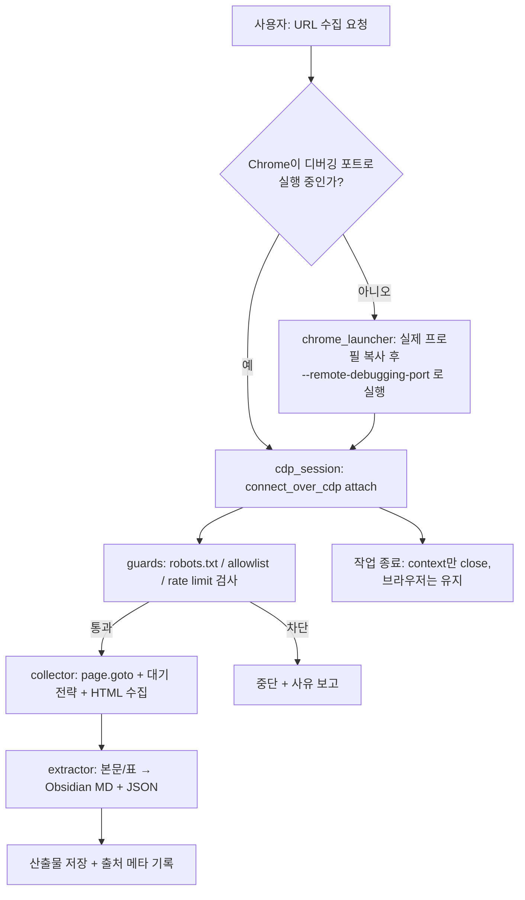

# Real Chrome Crawler Skill — PRD `v0.1`

> [!abstract] 한 줄 정의
> 사용자의 **실제 Chrome 세션**(로그인·쿠키·핑거프린트)을 CDP로 재사용해, 일반 자동화 브라우저가 봇으로 차단당하는 사이트의 페이지를 수집하고 **Obsidian 호환 Markdown + JSON**으로 정규화하는 **Claude Code Skill**.

---

## 1. 배경 & 문제 정의

기본 Playwright는 자체 번들 Chromium을 신규 프로필로 띄운다. 이 때문에 ① 로그인 세션·쿠키가 없고 ② `navigator.webdriver` 등 자동화 시그널과 신선한 핑거프린트가 노출되어 봇 탐지에 걸린다.

해결 전략은 **새 브라우저를 띄우지 않는 것**이다. 디버깅 포트로 실행된 실제 Chrome에 `connect_over_cdp`로 attach 하면, 대상 사이트 입장에서는 로그인된 진짜 사람의 트래픽과 구분되지 않는다.

> [!warning] 핵심 제약 (Chrome 정책)
> 최근 Chrome 정책상 **기본(default) User Data 디렉터리를 직접 자동화하는 것은 비지원**이다. 메인 프로필을 그대로 `user-data-dir`로 지정하면 페이지 미로딩·브라우저 종료가 발생할 수 있다. 따라서 본 스킬은 **실제 프로필 복사본**을 별도 디렉터리로 띄우는 것을 기본 전략으로 한다. (→ [[#OQ-2 프로필 전략 기본값]])

---

## 2. 목표 / 비목표

### 목표 (In Scope)
- 로그인 상태가 유지된 실제 Chrome 세션 재사용
- 단일 URL 페이지 수집 → 본문/표 추출 → 정규화 출력
- Obsidian 호환 Markdown(frontmatter + 출처 링크) **및** raw JSON 동시 산출
- Claude Code에서 `.skill` 한 줄 설치로 재사용

### 비목표 (Out of Scope, v0.1)
- 대규모 분산 크롤링 / 큐 기반 스케줄러
- CAPTCHA 자동 해제
- 헤드리스 서버 환경 운영 (로컬 데스크톱 전제)
- 멀티 사이트 동시 크롤 (v0.2+ 검토)

---

## 3. 아키텍처 개요

> [!info] 폴더 구조 (Package by Feature)

```
real-chrome-crawler/
├── SKILL.md                     # 트리거 description + 워크플로우 지시문 (필수)
├── pyproject.toml               # uv 관리, Python 3.12+
├── scripts/
│   ├── chrome_launcher.py       # 프로필 복사 + 디버깅 포트로 Chrome 실행 (OS별 분기)
│   ├── cdp_session.py           # connect_over_cdp attach / 컨텍스트 재사용 / 안전 종료
│   ├── collector.py             # 페이지 이동·대기 전략·HTML 수집
│   ├── extractor.py             # HTML/표 → Markdown(Obsidian) + JSON 정규화
│   └── guards.py                # robots.txt 확인 / rate limit / domain allowlist
└── references/
    └── selectors.md             # 사이트별 셀렉터·대기 전략 메모 (점증 축적)
```



---

## 4. Resolved Decisions

| ID | 결정 | 근거 |
|----|------|------|
| RD-1 | 산출물은 **Claude Code Skill**(SKILL.md + scripts/ + references/), `package_skill.py`로 `.skill` 패키징 | "한 줄 설치" 배포 모델과 일치 |
| RD-2 | Runtime = **Python 3.12+ / uv / Playwright(Python)** | 기존 스택 일관성, sync API로 단순화 |
| RD-3 | Chrome 연결 = **CDP `connect_over_cdp("http://localhost:<port>")`** | 실제 세션 재사용의 표준 기법 |
| RD-4 | 기본 프로필 전략 = **실제 프로필 복사본을 별도 user-data-dir로 launch** | Chrome 정책 회피 + 라이브 세션 비파괴 |
| RD-5 | 폴더 구조 = **Package by Feature** | 프로젝트 공통 컨벤션 |
| RD-6 | 출력 = **Obsidian MD(frontmatter+출처) + raw JSON 동시** | PKM 직접 연동 |
| RD-7 | 가드레일 = **robots.txt 토글 / random delay / domain allowlist** 기본 탑재 | 책임 있는 수집·과차단 방지 |
| RD-8 | 종료 시 **context만 close, 브라우저 유지** | 수동으로 연 사용자 브라우저 보호 |

---

## 5. Open Questions (→ v0.2 해소)

> [!question] OQ-1 타깃 OS 우선순위
> Chrome 실행 경로·명령이 OS별로 다름(Win: `chrome.exe`, macOS: `Google Chrome.app`, Linux: `google-chrome`). v0.1에서 **1순위로 지원할 OS**는?

> [!question] OQ-2 프로필 전략 기본값
> (A) 실제 프로필 **복사본 launch**(기본안, 안전·정책안전) vs (B) **이미 열린 Chrome에 attach**(설정 간단하나 사용자가 Chrome을 디버깅 포트로 직접 재실행해야 함). 기본값 확정 필요. → [[#7. 의사결정 요청 (트레이드오프)]]

> [!question] OQ-3 추출 범위
> v0.1 = 단일 페이지로 한정 vs 페이지네이션/무한스크롤 1단계 포함?

> [!question] OQ-4 robots.txt 위반 시 동작
> 차단(중단) / 경고 후 진행 / 무시 — 기본 정책은?

> [!question] OQ-5 인증 콘텐츠 범위 (법적)
> 로그인 전용 콘텐츠(회원 카페 등) 수집을 허용 범위로 둘지. ToS·개인정보·저작권 리스크 직결.

---

## 6. 마일스톤 → Claude Code 실행 단계 매핑

> [!todo] 단계별 실행 (한 번에 한 STEP 확정 → 실행 → 결과 보고 → 검증 → 다음 STEP)

- [ ] **STEP-01** — 프로젝트 스캐폴딩: uv init, Playwright 설치, 디렉터리 구조 생성, `pyproject.toml`
- [ ] **STEP-02** — `chrome_launcher.py`: OS 감지 + 프로필 복사 + `--remote-debugging-port` 실행 + 포트 헬스체크 *(핵심 노하우)*
- [ ] **STEP-03** — `cdp_session.py` + `collector.py`: attach, 컨텍스트 재사용, `page.goto` 대기 전략, 안전 종료
- [ ] **STEP-04** — `extractor.py` + `guards.py`: HTML→Obsidian MD/JSON 정규화, robots/rate-limit/allowlist
- [ ] **STEP-05** — `SKILL.md` 작성 + 테스트 프롬프트 2~3개 실행 + `.skill` 패키징

---

## 7. 의사결정 요청 (트레이드오프)

### OQ-2 프로필 전략

| 항목 | (A) 복사본 launch *(권장 기본)* | (B) 기존 Chrome attach |
|------|------------------------------|----------------------|
| 설정 난이도 | 스킬이 자동 처리 | 사용자가 매번 디버깅 포트로 Chrome 재실행 |
| 라이브 세션 영향 | 없음(별도 인스턴스) | 평소 브라우저를 닫았다 켜야 함 |
| Chrome 정책 충돌 | 회피 | 충돌 가능 |
| 세션 신선도 | 복사 시점 쿠키 | 실시간 동일 |
| 단점 | 디스크 사용·복사 시간, 2FA 재인증 가능성 | 사용자 수동 단계, 실수로 브라우저 종료 위험 |

**권장**: (A)를 기본값, (B)를 옵션 플래그로 제공.

### OQ-1 / OQ-4 권장 기본값
- OQ-1: 1순위 OS 1개만 알려주시면 해당 분기를 먼저 완성하고 나머지는 stub 처리.
- OQ-4: **경고 후 진행**을 기본값으로 제안(차단은 너무 공격적, 무시는 무책임). 설정으로 변경 가능.

> [!danger] 법적·정책 주의 (상시)
> 본 기법은 합법이나, 대상 사이트의 ToS·`robots.txt`·개인정보/저작권 법규 위반 소지가 있다. 특히 로그인 세션으로 회원 전용 콘텐츠를 수집하는 경우 약관 위반 가능성이 크다. 본인 데이터·공개 데이터·정당한 내부 용도 범위로 한정 권장.

---

## 8. 다음 액션

1. 위 **OQ-1, OQ-2, OQ-4** 확정(나머지는 v0.2로 이월 가능)
2. 확정 즉시 **STEP-01 instruction 파일** 생성 → Claude Code 실행 → 결과 표로 회신 → 검증 → STEP-02

%% v0.2에서 OQ-3/OQ-5 및 selectors.md 점증 정책 확정 예정 %%
