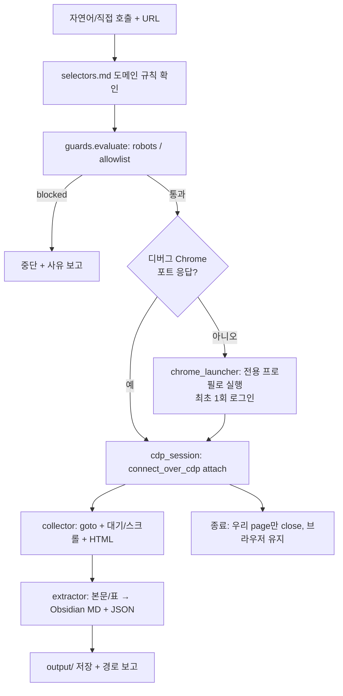

# Real Chrome Crawler Skill — PRD `v0.2`

> [!abstract] 한 줄 정의
> 사용자의 **실제 Chrome 세션**(전용 디버그 프로필, 로그인 영속)을 CDP로 재사용해, 일반 자동화 브라우저가 봇 차단당하는 사이트의 페이지를 수집하고 **Obsidian 호환 Markdown + JSON**으로 정규화하는 **Claude Code Skill**.

> [!success] v0.1 상태
> STEP-01~05 전부 구현·검증 완료. launcher → CDP attach → 수집 → 정규화 → 가드 → 스킬 발동까지 동작 확인. 배포(GitHub 마켓플레이스)는 선택 항목으로 미적용.

---

## 0. Changelog (v0.1 → v0.2)

| 구분 | 내용 |
|------|------|
| **수정** | RD-4: "프로필 복사본 launch" → **"전용 디버그 프로필(1회 로그인)"**. Chrome 136+ App-Bound Encryption으로 메인 프로필 쿠키 상속 불가가 확인됨 |
| **신설** | RD-9(Windows 1순위), RD-10(robots=warn 기본), RD-11(CLI UTF-8 강제), RD-12(selectors.md 소비 구조), RD-13(별도 테스트 프로젝트 검증) |
| **해소** | OQ-1/OQ-2/OQ-4 → Resolved |
| **이월** | OQ-3(추출 범위)·OQ-5(인증 콘텐츠 범위) → v0.3 |
| **추가 OQ** | OQ-6(기본 출력 경로)·OQ-7(selectors 코드 연결) |

---

## 1. 배경 (요약)

기본 Playwright는 신규 프로필의 번들 Chromium을 띄워 ① 로그인 세션 부재 ② 자동화 시그널 노출로 봇 차단에 걸린다. 해결책은 **디버깅 포트로 실행된 실제 Chrome에 `connect_over_cdp`로 attach**해, 진짜 사람의 트래픽과 구분되지 않게 하는 것이다.

> [!warning] Chrome 136+ 정책 (핵심 제약)
> `--remote-debugging-port`는 **기본 데이터 디렉터리에선 무시**되며 **비표준 `--user-data-dir`** 필수. 또한 비표준 디렉터리는 별도 암호화 키를 쓰므로 **메인 프로필 쿠키는 복호화 불가**. → 메인 프로필 복사 전략 폐기, **전용 디버그 프로필에 1회 로그인 후 영속 재사용**으로 확정(RD-4).

---

## 2. 목표 / 비목표

### 목표 (v0.1 달성)
- 전용 디버그 프로필 기반 실제 Chrome 세션 재사용 ✅
- 단일 URL 수집 → 본문/표 추출 → 정규화 출력 ✅
- Obsidian MD(frontmatter+출처) + JSON 동시 산출 ✅
- robots/rate-limit/allowlist 가드 ✅
- 자연어 요청 자동 발동 스킬 + 별도 테스트 프로젝트 검증 ✅

### 비목표 (현행 유지)
- 대규모 분산 크롤링 / 스케줄러
- CAPTCHA 자동 해제
- 헤드리스 서버 운영 (로컬 데스크톱 전제)

---

## 3. 아키텍처 (현행)

> [!info] 폴더 구조 (Package by Feature)

```
real-chrome-crawler/
├── SKILL.md                     # 트리거 description + 워크플로우 (selectors 확인 단계 포함)
├── pyproject.toml               # uv, Python 3.12+, ruff/mypy, mypy 오버라이드
├── scripts/
│   ├── console.py               # (v0.2) ensure_utf8_stdio — Windows CP949 대응
│   ├── chrome_launcher.py       # 전용 디버그 프로필 + --remote-debugging-port (Windows)
│   ├── cdp_session.py           # connect_over_cdp attach / 우리 page만 정리 (RD-8)
│   ├── collector.py             # page.goto + 대기 전략 + auto_scroll + HTML 수집
│   ├── extractor.py             # HTML → Obsidian MD + JSON, H1 중복 제거
│   └── guards.py                # robots.txt / rate limit / domain allowlist
└── references/
    └── selectors.md             # 도메인별 규칙(읽기+적용+기록), v0.1은 템플릿만
```



---

## 4. Resolved Decisions (통합)

| ID | 결정 | 상태 |
|----|------|------|
| RD-1 | 산출물 = Claude Code Skill(SKILL.md+scripts+references); 배포는 비공개 GitHub 마켓플레이스(선택) | 유지 |
| RD-2 | Python 3.12+ / uv / Playwright(sync) | 유지 |
| RD-3 | 연결 = `connect_over_cdp("http://localhost:<port>")` | 유지 |
| **RD-4** | **전용 디버그 프로필(비표준 user-data-dir, 1회 로그인 후 영속)**; `--attach` 옵션 | **수정** |
| RD-5 | Package by Feature | 유지 |
| RD-6 | Obsidian MD(frontmatter+출처) + JSON 동시 | 유지 |
| RD-7 | 가드 = robots.txt / random delay / domain allowlist | 유지 |
| RD-8 | 우리가 연 page만 close, 사용자 브라우저/컨텍스트 유지 | 유지 |
| **RD-9** | 1순위 OS = Windows; macOS/Linux는 `NotImplementedError` stub | 신설 |
| **RD-10** | robots 위반 기본 = `warn`(경고 후 진행); `block`/`ignore` 옵션 | 신설 |
| **RD-11** | CLI stdio UTF-8 강제(`ensure_utf8_stdio`)를 각 `main()` 시작에서 호출(import 부작용 없음) | 신설 |
| **RD-12** | `selectors.md` = 수집 전 확인·적용 + 신규 규칙 기록(읽는 참조); `auto_scroll` 연동, `content_selector` 자동적용은 v0.2 | 신설 |
| **RD-13** | 검증은 별도 테스트 프로젝트의 `.claude/skills/`(프로젝트 스코프)에서; 개발 소스와 분리 | 신설 |

> [!note] RD-11 구현 메모
> v0.1에서는 `extractor.py` 모듈 상단에 reconfigure를 임시 삽입했음. v0.2에서 `scripts/console.py`로 추출해 3개 진입점(`extractor`/`collector`/`chrome_launcher`)의 `main()`에서 호출하도록 리팩터(ruff E402·import 부작용 제거).

---

## 5. Open Questions (→ v0.3)

> [!question] OQ-3 추출 범위
> 단일 페이지 한정(현행) → 페이지네이션 / 무한스크롤 N단계 / 사이트 크롤 깊이 어디까지 확장?

> [!question] OQ-5 인증 콘텐츠 범위 (법적)
> 로그인 전용 콘텐츠(회원 카페 등) 수집 허용 범위. ToS·개인정보·저작권 리스크 직결.

> [!question] OQ-6 기본 출력 경로
> 현재 산출물이 스킬 폴더 내부(`${CLAUDE_SKILL_DIR}/output/`)에 쌓임 → 외부 vault/폴더로 분리 및 기본값 변경 방안.

> [!question] OQ-7 selectors.md 코드 연결
> `content_selector` 등 도메인 규칙을 extractor가 자동 로딩·적용하는 설계(데이터 포맷, 매칭, 폴백).

---

## 6. 구현 상태 & v0.2 백로그

> [!todo] v0.1 (완료)
> - [x] STEP-01 스캐폴딩 / [x] STEP-02 chrome_launcher / [x] STEP-03 cdp_session+collector
> - [x] STEP-04 extractor+guards / [x] STEP-05 SKILL.md + 테스트 프로젝트 검증
> - [x] H1 중복 제거, CLI UTF-8(임시 삽입)
> - [ ] (선택) GitHub 마켓플레이스 배포

> [!abstract] v0.2 백로그 (우선순위 순)
> 1. **인코딩 리팩터**: `console.py` 추출 + 3개 main()에서 호출 (RD-11 정식화)
> 2. **macOS/Linux 분기**: `chrome_launcher` OS별 경로/실행 (RD-9 stub 해소)
> 3. **기본 출력 경로 분리** (OQ-6)
> 4. **selectors.md 코드 연결**: `content_selector` 자동 적용 (OQ-7, 실제 검증 사이트 확보 후)
> 5. **OQ-3**: 페이지네이션/무한스크롤/크롤 깊이
> 6. **OQ-5**: 인증 콘텐츠 범위 정책
> 7. **본문 추출 엔진 어댑터화**: trafilatura 등 선택형 어댑터

---

## 7. 리스크 / 주의

> [!danger] 법적·정책 (상시)
> 기법 자체는 합법이나 대상 사이트의 ToS·`robots.txt`·개인정보/저작권 위반 소지가 있다. 특히 로그인 세션으로 회원 전용 콘텐츠를 수집하는 경우 약관 위반 가능성이 크다. 본인 데이터·공개 데이터·정당한 내부 용도로 한정 권장.

> [!warning] 기술 리스크
> - Chrome 정책 추가 변경 시 디버그 포트/프로필 동작이 바뀔 수 있음 → 런타임 헬스체크로 조기 감지
> - 사이트별 동적 로딩 편차 → `selectors.md` 규칙 축적으로 대응(점증)
> - 출력 경로가 설치본 내부면 사용자 데이터가 스킬 폴더에 누적 → OQ-6에서 해소

%% v0.3에서 OQ-3/5/6/7 해소 및 selectors 코드 연결 설계 확정 예정 %%
